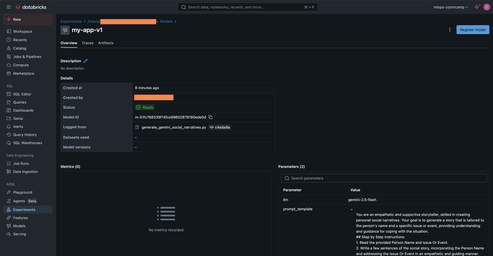

# ML for LLM Safety

## Objective and training data

Social narratives are a generally useful approach for teaching social skills, such as patience, empathy and tolerance, to humans with disabilities, including those on the autism spectrum. An affordable and scalable method to generate socail narrives is to use LLMs, however the input and output often include names, sensitive subjects and incidental disclosure of medical or physical information. So, there is a higher need for verifying that LLM outputs do not excessivley disclose personal health information or other private information.

The goal of this project is to train a ML judge (using MLOps best practices) of LLM output for social narrative creation. Training data will be simulated LLM output with and without disclosure of unique names or other identifying information and medical or physical information. The final web service API will take input and run the LLM genAI, followed by running the ML judge (registered in MLflow) to assess the safety of the LLM output.


## Project Status: Ambitious but unfinished

While significant progress was made in setting up the infrastructure and individual components, the project's ambitious scope proved to be a substantial undertaking, given my time availability. As a result, the simulated ML training data and end-to-end workflow was not fully realized. The existing codebase represents a foundational but incomplete implementation of the original vision. I further employed new cloud and MLOps tools, which required more effort to adapt from the MLOps Zoomcamp course material than I had available.

This README provides details on the implemented components, including how to train the model with tracking on Databricks MLflow and how to deploy the serverless API with Modal. 


## Note on multiple service cloud deployment

This repo has parts deployed to different cloud infrastructure, requiring accounts and authentication for each. In the case of Databricks a free trial is available, and for Modal.com a generous free tier for serverless deployments is available. However, it's not easy to fully replicate from only the repo, because the accounts have to be set up separately. So, I have a screenshot from Databricks MLflow to demonstrate it works, and the toy API on Modal is deployed and available.


## Accounts

* **Databricks**: 
   * A free trial of Databricks on AWS is available: [Databricks free trial](https://docs.databricks.com/aws/en/getting-started/free-trial)
   * Alternatively, Databricks can be used on Azure, GCP or SAP clouds, and on the trial page, the appropriate cloud can be selected at top right
   * Authentication to Databricks is required, and the method assumed in this repo is: [Databricks configuration profiles](https://docs.databricks.com/aws/en/dev-tools/auth/config-profiles)
   * An authentication profile is configured most easily with the Databricks CLI tools: `databricks configure`, CLI installation instructions at [Databricks CLI tutorial](https://docs.databricks.com/aws/en/dev-tools/cli/tutorial)

* **Modal.com**: 
   * A free tier of Modal.com is available: [Modal.com pricing](https://modal.com/pricing)
   * Authentication to Modal from a dev computer is easiest from `uv`, which will open a browser to authorize access and set up a token locally:
   ```
   cd ml-deploy
   uv run python3 -m modal setup
   ```


## Train locally with tracking and registry in Databricks MLflow

```
$ cd ml-train
$ uv run generate_gemini_social_narratives.py 
```

The `mlflow` server is run on Databricks on AWS.



## Serverless web service deployment to Modal

To create environment secrets `Databricks-MLflow` to securely interact with Databricks and its managed MLflow, run the following using the modified `.env` file:
```
$ cd ml-deploy
$ uv run modal secret create Databricks-MLflow --from-dotenv .env
```

To deploy the app to Modal for live FastAPI, add credentials for Modal and then run:
```
$ cd ml-deploy
$ uv run modal deploy modal_fastapi_endpoint.py --name gemini-llm-safety
```


## Using the API

Test the FastAPI response:
```
$ curl -X POST -H 'Content-Type: application/json' --data-binary '{"qty": 5}' https://jhuff-genomics--gemini-llm-safety-stream-me.modal.run
```

OpenAPI (aka Swagger) docs for how to use the API are at:
[https://jhuff-genomics--gemini-llm-safety-stream-me.modal.run/docs/](https://jhuff-genomics--gemini-llm-safety-stream-me.modal.run/docs/)


## Technologies 

* **Cloud**: AWS + Databricks (for `ml-train/`), Modal.com serverless containers (for `ml-deploy/`)
* **Experiment tracking and model registry**: Databricks MLflow
* **Monitoring**: Databricks MLflow Tracing
* **Best Practices**:
  * `uv` package management
  * `ruff` linting and code formatting
  * `pre-commit` hooks
